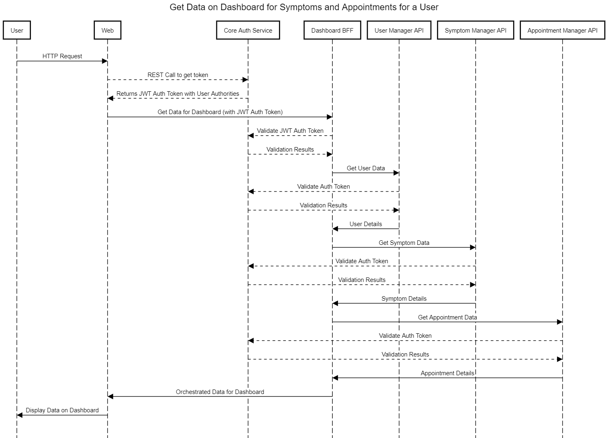

# sinthoma
An in-progress comprehensive health and symptom tracker.

## High Level Component Architecture Diagram

## Low Level Design

### Sequence Diagram
Below is a sequence diagram of a typical request flow in the application.

### Stack Used

1. **Methodology**: Behaviour Driven Development BDD using Cucumber 4.7
2. **Microservice Design Patterns**: Decomposition by Business Capability, Database per Service, Backend For Frontend BFF and Log Aggregation Observability pattern
3.  **Programming Language**: Java 8
4.  **Database**: Mongo DB 4.0
5.  **UI Stack**: HTML 5, CSS 3, Javascript 3
6.  **Templating Engine**: Thymeleaf 3.0
7.  **Framework**: Spring Boot 2.1 with Spring-Security, Spring-Data-REST 
8.  **Test Framework**: JUnit 5, Jupiter Engine 
9.  **Documentation**: Swagger 2
10.  **Container Platform**: Docker  

### Maven Module Design - Current State

### API Summary

| #  | Layer | Component                  | Host      | Port | BaseURL                | API Documentation                      |
|----|-------|----------------------------|-----------|------|------------------------|----------------------------------------|
| 1  | UI    | Sinthoma Web               | localhost | 8093 | /sinthoma              |                                        |
| 2  | UI    | Sinthoma App               |           |      |                        |                                        |
| 3  | BFF   | Dashboard BFF              |           |      |                        |                                        |
| 4  | BFF   | Daily Tracker BFF          |           |      |                        |                                        |
| 5  | BFF   | Stats Reports BFF          |           |      |                        |                                        |
| 6  | CORE  | User Manager API           | localhost | 8092 | /sinthoma/user-manager | /sinthoma/user-manager/swagger-ui.html |
| 7  | CORE  | Symptom Manager API        |           |      |                        |                                        |
| 8  | CORE  | Appointment Manager API    |           |      |                        |                                        |
| 9  | CORE  | Medication Manager API     |           |      |                        |                                        |
| 10 | CORE  | Food Nutrition Manager API |           |      |                        |                                        |
| 11 | CORE  | Report Manager API         |           |      |                        |                                        |
| 12 | CORE  | Notification Manager API   |           |      |                        |                                        |
| 13 | PROXY | Weather Proxy API          |           |      |                        |                                        |
| 14 | PROXY | Email Proxy API            |           |      |                        |                                        |
| 15 | DB    | Mongo DB                   | localhost | 8091 | -                      |                                        |
| 16 | DB    | Mongo DB Express           | localhost | 8090 | /db/sinthoma           |                                        |

## Status Summary
| #  | Layer | Component                  | Status      | Planned | Designed    | Developed   | Tested | Released |
|----|-------|----------------------------|-------------|---------|-------------|-------------|--------|----------|
| 1  | UI    | Sinthoma Web               | IN PROGRESS | YES     | YES         | IN PROGRESS | NO     | NO       |
| 2  | UI    | Sinthoma App               | NOT PLANNED | NO      | NO          | NO          | NO     | NO       |
| 3  | BFF   | Dashboard BFF              | IN PROGRESS | YES     | YES         | IN PROGRESS | NO     | NO       |
| 4  | BFF   | Daily Tracker BFF          | IN PROGRESS | YES     | IN PROGRESS | NO          | NO     | NO       |
| 5  | BFF   | Stats Reports BFF          | NOT PLANNED | NO      | NO          | NO          | NO     | NO       |
| 6  | CORE  | User Manager API           | IN PROGRESS | YES     | YES         | IN PROGRESS | NO     | NO       |
| 7  | CORE  | Symptom Manager API        | IN PROGRESS | YES     | YES         | IN PROGRESS | NO     | NO       |
| 8  | CORE  | Appointment Manager API    | IN PROGRESS | YES     | IN PROGRESS | NO          | NO     | NO       |
| 9  | CORE  | Medication Manager API     | NOT PLANNED | NO      | NO          | NO          | NO     | NO       |
| 10 | CORE  | Food Nutrition Manager API | NOT STARTED | NO      | NO          | NO          | NO     | NO       |
| 11 | CORE  | Report Manager API         | NOT STARTED | NO      | NO          | NO          | NO     | NO       |
| 12 | CORE  | Notification Manager API   | NOT STARTED | NO      | NO          | NO          | NO     | NO       |
| 13 | PROXY | Weather Proxy API          | NOT STARTED | NO      | NO          | NO          | NO     | NO       |
| 14 | PROXY | Email Proxy API            | NOT STARTED | NO      | NO          | NO          | NO     | NO       |
