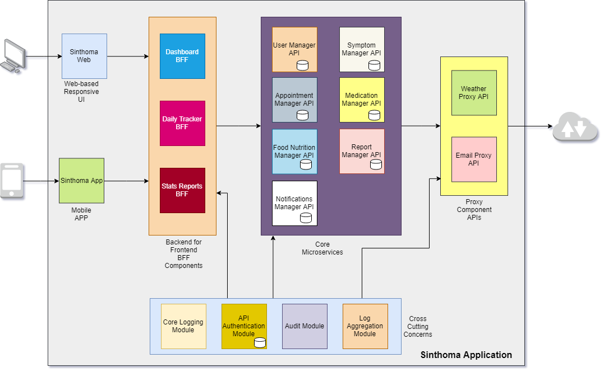

# sinthoma
An in-progress comprehensive health and symptom tracker.

## High Level Component Architecture Diagram

### Component Status Summary

| #  | Layer | Component                  | Status      | Planned | Designed    | Developed   | Tested | Released |
|----|-------|----------------------------|-------------|---------|-------------|-------------|--------|----------|
| 1  | UI    | Sinthoma Web               | IN PROGRESS | YES     | YES         | IN PROGRESS | NO     | NO       |
| 2  | UI    | Sinthoma App               | NOT PLANNED | NO      | NO          | NO          | NO     | NO       |
| 3  | BFF   | Dashboard BFF              | IN PROGRESS | YES     | YES         | IN PROGRESS | NO     | NO       |
| 4  | BFF   | Daily Tracker BFF          | IN PROGRESS | YES     | IN PROGRESS | NO          | NO     | NO       |
| 5  | BFF   | Stats Reports BFF          | NOT PLANNED | NO      | NO          | NO          | NO     | NO       |
| 6  | CORE  | User Manager API           | IN PROGRESS | YES     | YES         | IN PROGRESS | NO     | NO       |
| 7  | CORE  | Symptom Manager API        | IN PROGRESS | YES     | YES         | IN PROGRESS | NO     | NO       |
| 8  | CORE  | Appointment Manager API    | IN PROGRESS | YES     | IN PROGRESS | NO          | NO     | NO       |
| 9  | CORE  | Medication Manager API     | NOT PLANNED | NO      | NO          | NO          | NO     | NO       |
| 10 | CORE  | Food Nutrition Manager API | NOT STARTED | NO      | NO          | NO          | NO     | NO       |
| 11 | CORE  | Report Manager API         | NOT STARTED | NO      | NO          | NO          | NO     | NO       |
| 12 | CORE  | Notification Manager API   | NOT STARTED | NO      | NO          | NO          | NO     | NO       |
| 13 | PROXY | Weather Proxy API          | NOT STARTED | NO      | NO          | NO          | NO     | NO       |
| 14 | PROXY | Email Proxy API            | NOT STARTED | NO      | NO          | NO          | NO     | NO       |